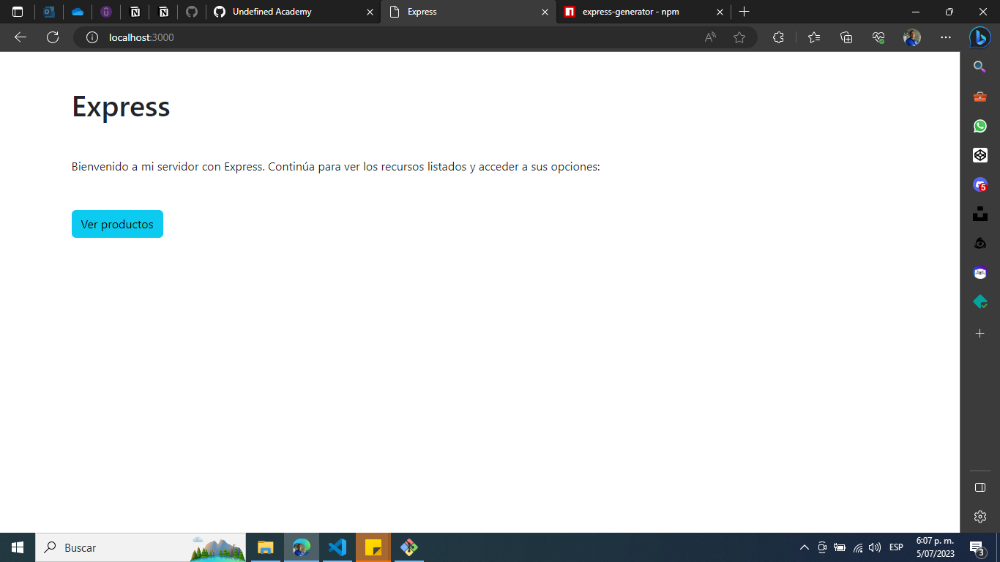
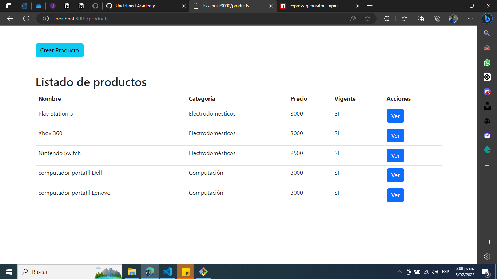
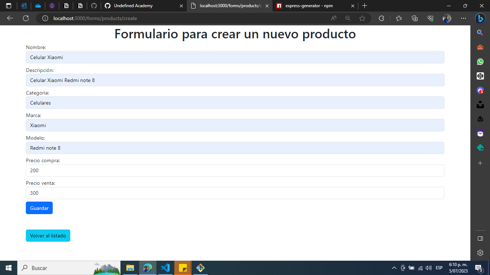
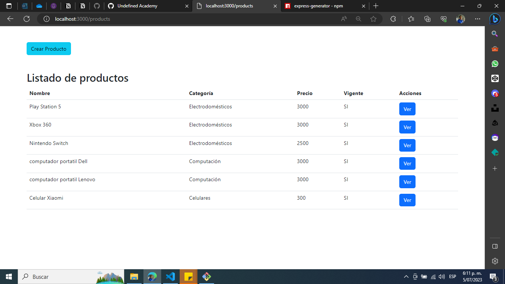
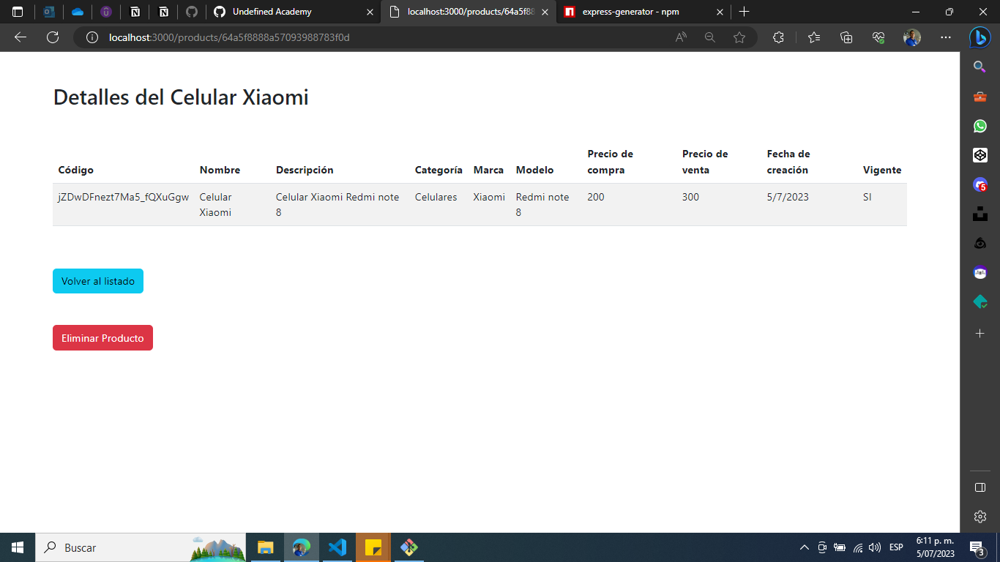
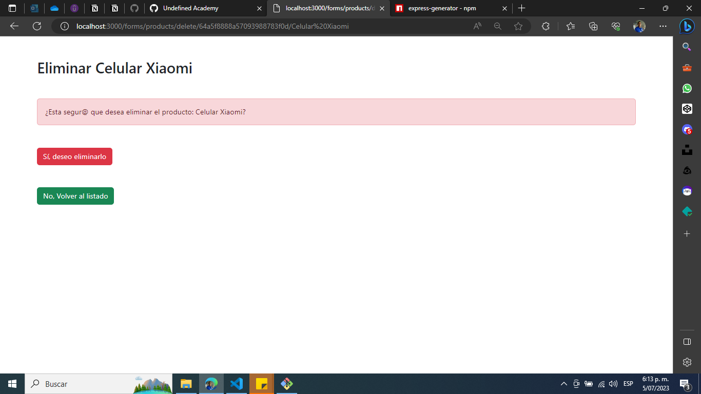
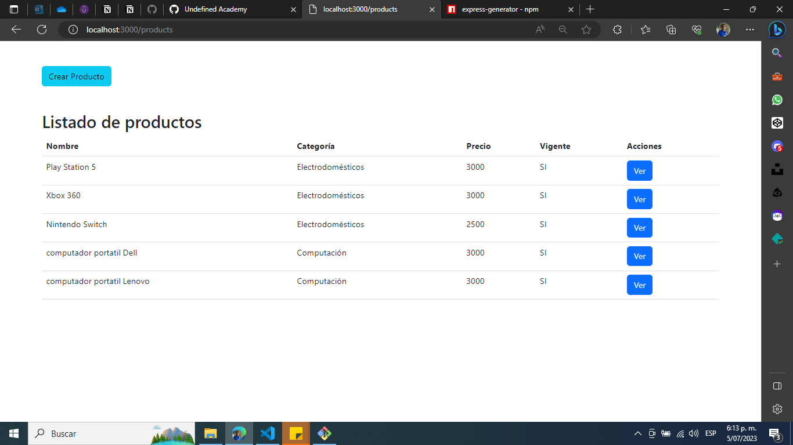

# Nombre del proyecto

Servidor Express jaardila

## Instalación

1. Clona este repositorio.
2. Ejecuta `npm install` para instalar las dependencias.
3. Ejecuta `npm start` para iniciar el servidor.

## Uso

1. Abre tu navegador web y navega a `http://localhost:3000`.
2. Verás una breve descripción y un boton para ir a la lista de productos disponibles.
3. Haz clic en un producto para ver sus detalles.
4. Haz clic en el botón "Nuevo producto" para crear uno nuevo.
5. Haz clic en el botón "Eliminar" dentro de los detalles de un producto para eliminarlo.


## Créditos

- Jorge Alexander Ardila 

## Express Generator

Para instalar la plantilla con vistas .pug en Express Generator de Node.js, debes seguir los siguientes pasos:

1. Instala Express Generator si no lo tienes instalado: `npm install express-generator -g`.
2. Crea una nueva aplicación Express con la opción `-view=pug`: `express --view=pug myapp`.
3. Ingresa al directorio de la aplicación: `cd myapp`.
4. Instala las dependencias: `npm install`.
5. Ejecuta la aplicación: `npm start`.

### Explicación de los archivos y directorios principales

```
- bin: Este directorio contiene el archivo www, que es el punto de entrada de la aplicación. Este archivo crea un servidor HTTP y lo configura para escuchar en el puerto especificado (por defecto, el puerto 3000).
- public: Este directorio contiene archivos estáticos como imágenes, hojas de estilo y archivos JavaScript que se servirán al cliente.
- routes: Este directorio contiene los archivos que definen las rutas de la aplicación. Cada archivo define un conjunto de rutas relacionadas con una funcionalidad específica.
- views: Este directorio contiene las plantillas de vistas que se utilizan para generar la interfaz de usuario. Por defecto, Express utiliza el motor de plantillas Pug (anteriormente conocido como Jade).
- app.js: Este archivo es el punto de entrada principal de la aplicación. Aquí se configura la aplicación y se definen las rutas.
```

## Pantallazos

- localhost:3000



- Listado de productos



- Crear producto



- Producto creado



- Ver producto



- Eliminar producto



- Producto eliminado

